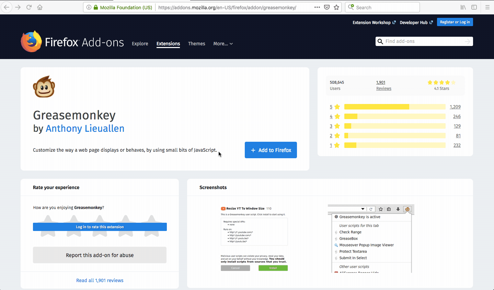

# Remove Linkedin Connection

:bust_in_silhouette: Remove a linkedin connection with a single click.

> * This script adds a `Remove` button on the linkedin [connection](https://www.linkedin.com/mynetwork/invite-connect/connections/) page
> * When the remove button is clicked it removes the connection instantly compared to going through three different steps of clicks.
> * this helps you save time in managing your connections, when you have a large no of unwanted connections. 

## Use :computer:

* You can add the script from `index.js` to any scripts like [greasemonkey](https://addons.mozilla.org/en-US/firefox/addon/greasemonkey/) and enable the script.
* You will then see a remove button on  [connection](https://www.linkedin.com/mynetwork/invite-connect/connections/) page, which removes a connection in a single click

### Demo :video_camera:

